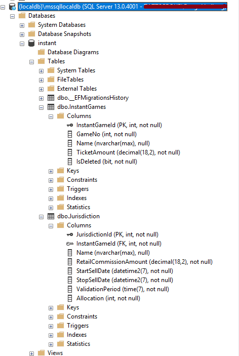
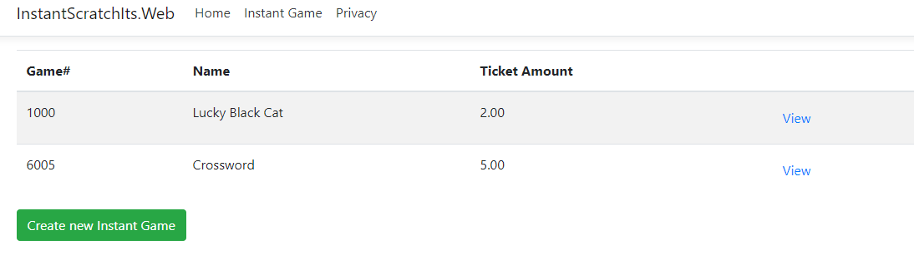

**.NET Core Entity Framework - *There And Back Again***

This repository contains several branches, each with some changes implementing different features of using .NET Core Entity Framework in a ASP.NET Core MVC application.

**Step 1 - Create the project**

Create a local folder:

```mkdir InstantScratchIts```

and in that folder a solution file:

```dotnet new sln --name InstantScratchIts```

Create an ASP.NET Core MVC project:

``` dotnet new mvc --name InstantScratchIts.Web --output InstantScratchIts.Web```

and add it to the solution:

```dotnet sln add .\InstantScratchIts.Web\InstantScratchIts.Web.csproj```

That's it! Let's build and run the project to ensure that it all works:

```dotnet build```

```dotnet run -p .\InstantScratchIts.Web\InstantScratchIts.Web.csproj```

**Step 2 - Add Entity Framework Core**

In this step we will :

* choose a database provider, i.e SQL Server, Postgres or similar. See [list of providers](https://docs.microsoft.com/en-us/ef/core/providers/) for every option.
* add the EF Core NuGet packages
* configure the database connection string
* setup the [DBContext](https://github.com/bengthedberg/EntityFrameworkCore/blob/master/src/EFCore/DbContext.cs). You use the DbContext in your application to both
  configure EF Core and to access the database at runtime.


We will use SQL Server as the database provider so we need to add the Microsoft.EntityFrameworkCore.SqlServer NuGet package.

``` dotnet add .\InstantScratchIts.Web\InstantScratchIts.Web.csproj package Microsoft.EntityFrameworkCore.SqlServer```

We will also add the Microsoft.EntityFrameworkCore.Tools NuGet package as this will allow us to create and update your database from the command line.


We will add the database connection string to the application settings file. In this example we will just use the localdb as default. 
```"Server=(localdb)\\mssqllocaldb;Database=instant;Trusted_Connection=True;MultipleActiveResultSets=true"```


Finally we register the AppDbContext in the ConfigureServices method of Startup.cs.
EF Core provides a generic AddDbContext<T> extension method for this purpose,
which takes a configuration function for a [DbContextOptionsBuilder ](https://docs.microsoft.com/en-us/ef/core/providers/). This
builder can be used to set a host of internal properties of EF Core and lets you completely
replace the internal services of EF Core if you want.

Finish up with a rinse and repeat, i.e build and run :

```dotnet build```

```dotnet run -p .\InstantScratchIts.Web\InstantScratchIts.Web.csproj```

**Step 3 - Create a database schema**

Create the schema by creating your POCO classes and register them with the DBSet 

In this case we have instant scratch it game that is valid in one or more jurisdictions. 

**Step 4 - Create database**

To create the actual database we will use the dotnet CLI tool to add a migration step:

```dotnet ef migrations add --project .\InstantScratchIts.Web\InstantScratchIts.Web.csproj InitialSchema```

You can then apply the migration using the following command:

```dotnet ef database update --project .\InstantScratchIts.Web\InstantScratchIts.Web.csproj``` 

This command performs four steps:

1. Builds your application.
2. Loads the services configured in your app’s Startup class, including AppDb-
   Context.
3. Checks whether the database in the AppDbContext connection string exists. If
   not, creates it.
4. Updates the database by applying any unapplied migrations.

Use SSMS and verify that the database now exists with the tables.



**Step 5 - Create the domain service**

The domain service will be responsible for business logic. This will handle querying the database for games, creating new games and modifying existing ones. 

As this app only has a simple domain, I’ll be using InstantGameService to handle all of the requirements, but in your own apps you may have multiple services that cooperate to provide the business logic.

We will also add the service to the dependency injection container in the Startup.ConfigureServices method:. 

```services.AddScoped<InstantGameService>();```

**Step 6 - Read Data**

Lets start with creating a controller for accessing the games. 

``` c#
namespace InstantScratchIts.Web.Controllers
{
    public class InstantGameController : Controller
    {
        public InstantGameService _service;
        public InstantGameController(InstantGameService service)
        {
            _service = service;
        }
    }
}
```

then add a default index action:

```c#
public IActionResult Index()
{
    var models = _service.GetInstantGames();

    return View(models);
}
```
We also need to create the GetInstantGames method which is supposed to return all instant games:

```c#
public ICollection<InstantGamesSummaryViewModel> GetInstantGames()
{
    return _context.InstantGames
        .Where(r => !r.IsDeleted)
        .Select(x => new InstantGamesSummaryViewModel
                {
                    Id = x.InstantGameId,
                    GameNo = x.GameNo,
                    Name = x.Name,
                    TicketAmount = x.TicketAmount,
                })
        .ToList();
}
```
The method will return a view model that can be returned to the client. The view models looks like this:

```c#
namespace InstantScratchIts.Web.Models
{
    public class InstantGamesSummary
    {
        public class InstantGamesSummaryViewModel
        {
            public int Id { get; set; }
            public int GameNo { get; set; }
            public string Name { get; set; }
            public int NumberOfJurisdictions { get; set; }

            public static InstantGamesSummaryViewModel FromInstantGame(InstantGame instantGame)
            {
                return new InstantGamesSummaryViewModel
                {
                    Id = instantGame.InstantGameId,
                    GameNo = instantGame.GameNo,
                    Name = instantGame.Name,
                    NumberOfJurisdictions = instantGame.Jurisdiction.Count
                };
            }
        }
    }
}
```
Finally we just need to create the view:

```html
@model ICollection<InstantGamesSummaryViewModel>
@{
    ViewData["Title"] = "Instant Games";
}

div class="table-responsive">
    <table class="table table-striped instantgame">
        <thead>
            <tr>
                <th>Game#</th>
                <th>Name</th>
                <th>Ticket Amount</th>
                <th></th>
            </tr>
        </thead>
        <tbody>
            @foreach (var instantgame in Model)
            {
            <tr>
                <td>@instantgame.GameNo</td>
                <td>@instantgame.Name</td>
                <td>@instantgame.TicketAmount</td>
                <td><a asp-action="View" asp-route-id="@instantgame.Id" class="btn">View</a></td>
            </tr>
            }
        </tbody>
    </table>
</div>
<a asp-action="Create" class="btn btn-success">Create new Instant Game</a>
```

Add a menu link the controller in the main layout and you are ready to run. Though lets just add some dummy data in the database first...



Lets add the view detail functionality as well.

First create the View action on the controller :

```c#
public IActionResult View(int id)
{
    var model = _service.GetInstantGameDetail(id);
    if (model == null)
    {
        // If id is not for a valid instant game, generate a 404 error page
        // TODO: Add status code pages middleware to show friendly 404 page
        return NotFound();
    }
    return View(model);
}
```
Then add the GetInstantGameDetail method to the service:

```c#
public InstantGameDetailViewModel GetInstantGameDetail(int id)
{
    return _context.InstantGames
        .Where(x => x.InstantGameId == id)
        .Where(x => !x.IsDeleted)
        .Select(x => new InstantGameDetailViewModel
                {
                    Id = x.InstantGameId,
                    Name = x.Name,
                    TicketAmount = x.TicketAmount,
                    Jurisdictions = x.Jurisdiction
                        .Select(region => new InstantGameDetailViewModel.Region
                                {
                                    Name = region.Name,
                                    Allocation = region.Allocation
                                })
                })
        .SingleOrDefault();
}
```
Again we have a new view model

```c#
public class InstantGameDetailViewModel
{
    public int Id { get; set; }
    public int GameNo { get; set; }
    public string Name { get; set; }
    public decimal TicketAmount { get; set; }

    public IEnumerable<Region> Jurisdictions { get; set; }

    public class Region
    {
        public string Name { get; set; }
        public int Allocation { get; set; }
    }
}
```
Lets add the view for instant game details...

```html
@model InstantGameDetailViewModel
@{
    ViewData["Title"] = Model.Name;
}
<h3>Game Details</h3>
<p>@Model.GameNo - @Model.Name - $@Model.TicketAmount</p>
<form asp-action="Delete" asp-route-id="@Model.Id">
    <p>
        <a asp-action="Edit" asp-route-id="@Model.Id" class="btn btn-primary">Edit</a>
        <button class="btn btn-danger">Delete</button>
    </p>
</form>

<h3>Jurisdictions</h3>
<dl>
    @foreach (var item in Model.Jurisdictions)
    {
        <dt>@item.Name</dt>
        <dd>@item.Allocation</dd>
    }
</dl>
```

Run and test

**Step 7 - Edit Data**

In the view detail page there is an edit button:

`<a asp-action="Edit" asp-route-id="@Model.Id" class="btn btn-primary">Edit</a>`

So lets add the Edit action to the controller:

```c#
public IActionResult Edit(int id)
{
    var model = _service.GetInstantGameForUpdate(id);
    if (model == null)
    {
        // If id is not for a valid game, generate a 404 error page
        // TODO: Add status code pages middleware to show friendly 404 page
        return NotFound();
    }
    return View(model);
}
```
then add the business logic to the service :

```c#
public UpdateInstantGameCommand GetInstantGameForUpdate(int id)
{
    return _context.InstantGames
        .Where(x => x.InstantGameId == id)
        .Where(x => !x.IsDeleted)
        .Select(x => new UpdateInstantGameCommand
                {
                    Name = x.Name,
                    GameNo = x.GameNo,
                    TicketAmount = x.TicketAmount,
                })
        .SingleOrDefault();
}
```
And the command and model :

```c#
namespace InstantScratchIts.Web.Models
{
    public class UpdateInstantGameCommand : EditInstantGameBase
    {
        public int Id { get; set; }

        public void UpdateInstantGame(InstantGame game)
        {
            game.Name = Name;
            game.GameNo = GameNo;
            game.TicketAmount = TicketAmount;
        }
    }
}

```
​      
```c#
namespace InstantScratchIts.Web.Models
{
    public class EditInstantGameBase
    {
        [Required, StringLength(100)]
        public string Name { get; set; }
        [Range(0, 24), DisplayName("Name of the Game")]
        public int GameNo { get; set; }
        [Range(1000, 9999), DisplayName("Game Number")]
        public decimal TicketAmount { get; set; }
      
    }
}
```

Finally add the view:


```html
@model UpdateInstantGameCommand
@{
    ViewData["Title"] = "Edit Instant Game";
}

<h2>@ViewData["Title"]</h2>
<hr />

<form asp-controller="InstantGame" asp-action="Edit" method="post" class="form-horizontal">
    <div asp-validation-summary="ModelOnly" class="text-danger"></div>

    @Html.Partial("_EditInstantGamePartial")

    <div class="form-group">
        <div class="col-md-offset-2 col-md-10">
            <input type="hidden" asp-for="Id" />
            <button type="submit" class="btn btn-primary">Update</button>
        </div>
    </div>
</form>

@section Scripts {
    @{ await Html.RenderPartialAsync("_ValidationScriptsPartial"); }
}
```
```html
@model EditInstantGameBase

<div class="form-group">
    <label asp-for="Name" class="col-md-2 control-label"></label>
    <div class="col-md-10">
        <input asp-for="Name" class="form-control" />
        <span asp-validation-for="Name" class="text-danger"></span>
    </div>
</div>
<div class="form-group">
    <label asp-for="GameNo" class="col-md-2 control-label"></label>
    <div class="col-md-10">
        <textarea asp-for="GameNo" class="form-control"></textarea>
        <span asp-validation-for="GameNo" class="text-danger"></span>
    </div>
</div>
<div class="form-group">
    <label asp-for="TicketAmount" class="col-md-2 control-label"></label>
    <div class="col-md-10">
        <input asp-for="TicketAmount" class="form-control" />
        <span asp-validation-for="TicketAmount" class="text-danger"></span>
    </div>
</div>

```

